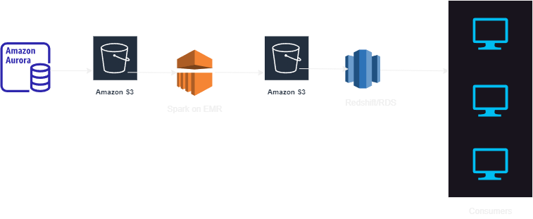
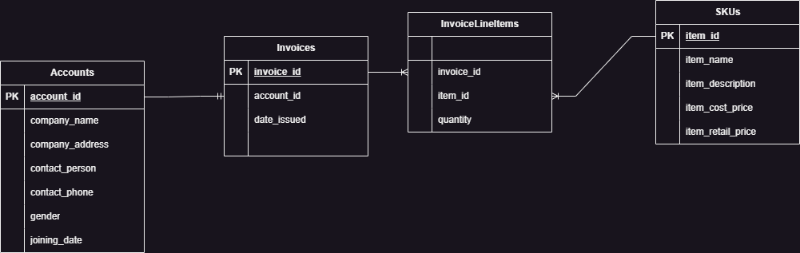
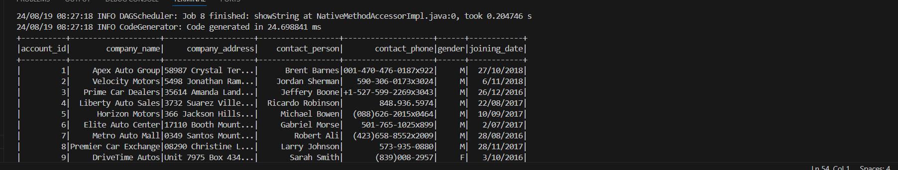
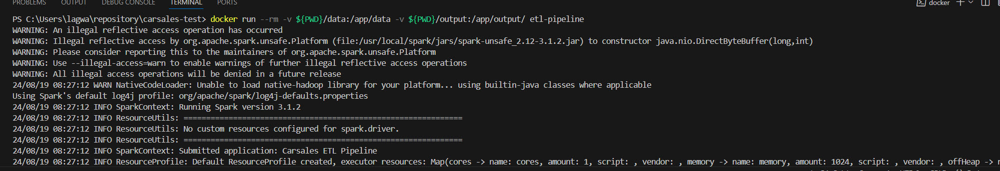
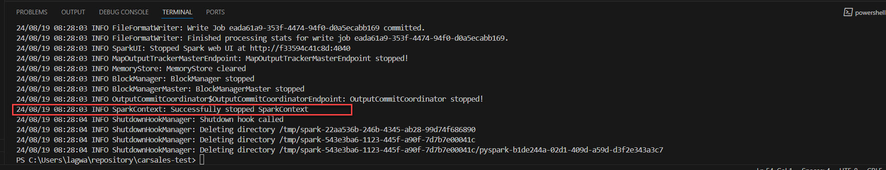
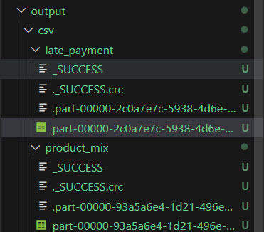

# Overview
This repository contains a Spark-based ETL pipeline designed to process raw data, extract useful features, and store the processed data for analytics purposes. The code is generic and reusable, allowing you to easily modify it to work with different datasets and transformations.  


# Problem Statement  
Enable business to know 
1. Late invoice payments
2. Types of SKUs purchased by each account

# Logic
Assumption: A standard payment term of 30 days  
**Feature: Late Payment**
1. Load all the input datasets
2. Join invoice_line_items with skus to get product details
3. Calculate total cost per invoice
4. Calculate the number of days since the invoice was issued
5. Determine if an invoice is late
6. Aggregate late payment information by account
7. Join with accounts dataset to get customer details

**Feature: Product Mix**
1. Load all the input datasets
2. Join all the input datasets on respective join column
3. Aggregate item_name by grouping account_id, company_name
4. While writing to CSV, convert array column to string column

# Design Consideration and Scalability
* **Spark**: Spark is popular and widely used for its ability to handle large-scale data sets processing and its built-in support for distributed computing.  
* **Data Storage**: Parquet, again widely popular and efficient for querying datasets and provides good compression  
* **Incremental Processing**: Enhance the pipeline to process only new or changed data in each run, making it scalable for larger datasets  
* **Partitioning**: We can partition the output based on date or any key which is frequently used in Filter criteria while querying dataset.  
* **EMR**: We can use auto-scaling group to dynamically allocate resources based on workload.

# Intermediate Data Models
1. We can store raw datasets on S3 because of number of benefits S3 offers such as Durability, Cost Effectiveness, Scalability etc.
2. We can also store results from intermediate transformation on datasets for immediate access for business for analysis or query purpose. We can use either S3 or create Athena tables using Glue. If volume is large we can use, Redshift or any RDS on Aurora or Postgres on AWS which makes dataset available for querying with low-latency
3. To store the final output, we can again make use of S3, as S3 can be used as Data Lake and other systems can easiliy access files on S3 for their purpose

# Current Architecture


**Data Flow Overview**:
1.	**Source Systems**: The data is stored in AWS Aurora MySQL databases. We will perform periodic extracts from these databases.
2.	**ETL Process**:  
o	**Extract**: Pull data from Aurora MySQL using a tool like AWS Data Pipeline, AWS Glue, or a custom Lambda function scheduled to run periodically (e.g., daily, weekly).  
o	**Transform**: Clean, normalize, and prepare the data for analytics. This may involve joining tables, filtering unnecessary data, and creating derived features.  
o	**Load**: Store the transformed data in a data warehouse like Amazon Redshift or an S3-based data lake.
3.	**Data Warehouse/Data Lake**:  
o	Store historical versions of the data, allowing the analysts to query data as of any point in time. Partitioning by date or snapshot version would help in efficiently managing and querying the data.  
o	For the finance team, ensure the invoice data is loaded into a separate schema or database that is optimized for SQL queries.  
4.	**Analytics Layer**:  
o	BI Tools: The analysts will access the data through a BI tool like Amazon QuickSight, Tableau, or any SQL-based tool they are comfortable with.  

**Key Architectural Decisions**:  
•	Batch Processing: Since CDC is not yet enabled, a batch ETL process is appropriate. This will run on a scheduled basis, perhaps daily or weekly, depending on data freshness requirements.  
•	Data Versioning: Implementing partitioning or using versioned tables to keep snapshots of data over time allows analysts to compare data across different time periods.  
•	Data Lake vs Data Warehouse: If your data volume is large and varied, consider a data lake on S3. For structured, SQL-friendly querying, use Redshift.  

# Directory Structure
```bash 
carsales_test/  
│  
├── data/  
|   |── accounts.csv  
│   ├── invoices.csv  
│   ├── invoice_line_items.csv  
│   └── skus.csv  
│  
├── src/  
│   ├── etl_pipeline.py  
│   ├── load.py  
│   ├── transform.py  
│   ├── utils.py  
│   └── __init__.py  
│  
├── requirements.txt  
└── Dockerfile  
```

* `data/`: Directory containing input CSV files.  
* `output/`: Directory where processed data will be stored.  
* `src/`: Directory containing the ETL Spark job script and other helper functions.  
* `README.md`: This documentation file.  
* `Dockerfile`: To build and run the image

# Entity Relationships Diagram


# Requirements
Python 3.x  
Apache Spark (preferably version 3.x)  
PySpark  

# Setup
1. Clone the Repository:

    ```bash 
    git clone https://github.com/hlagvankar/carsales-test.git
    cd https://github.com/hlagvankar/carsales-test.git
    ```

2. Install Dependencies:

   Make sure you have Python 3.x installed. Then, install PySpark using pip:

    ```bash
    pip install pyspark
    ```
3. Place Your Data:

    Add your CSV files to the data/ directory. The expected files are:  
    &emsp; accounts.csv  
    &emsp; skus.csv  
    &emsp; invoices.csv  
    &emsp; invoice_line_items.csv  

# Running the ETL Job
I have used Docker for portability, so make sure Docker is installed on your machine.  
To build & run the ETL job, use the following command:

```bash 
docker build -t etl-pipeline .
```  
```bash
docker run --rm -v $(pwd)/data:/app/data -v $(pwd)/output:/app/output etl-pipeline
```
To run in windows powershell
```bash
docker run --rm -v ${PWD}/data:/app/data -v ${PWD}/output:/app/output etl-pipeline
```

1. --rm:  
Automatically remove the container when it exits.
2. -v $(pwd)/data:/app/data:  
Mounts your local data directory to the container’s /app/data directory.
3. -v $(pwd)/output:/app/output:  
Mounts your local output directory to the container’s /app/output directory.
4. etl-pipeline:  
The name of the Docker image to run.

# Future State Architecture


**Enhanced Data Flow with CDC**:
1.	Source Systems with CDC:  
o	CDC Events: Once CDC is enabled, changes from the Aurora MySQL databases will be streamed into a Kafka topic.  
2.	ETL Process:  
o	Real-time Extract: Consume Kafka topics using a stream processing tool like Kafka Streams or AWS Kinesis.  
o	Transform: Perform transformations on the streaming data. This might include real-time data enrichment, filtering, and normalization.  
o	Load: Continuously load the transformed data into your data warehouse or data lake.  
3.	Data Warehouse/Data Lake:  
o	Same as above, but with more frequent updates due to the near real-time nature of the CDC streams.  
o	Implement incremental updates rather than full batch loads, reducing the time and resource consumption.  
4.	Analytics Layer:  
o	The analytics tools will now see more up-to-date data as the warehouse or data lake is continuously updated with the latest changes.  

**Key Architectural Decisions**:  
•	Stream Processing: Incorporating a stream processing tool to handle real-time data as it flows in from Kafka will ensure low latency in data availability.  
•	Data Consistency: Ensure that the data pipeline handles exactly-once processing to avoid duplicates, especially with financial data.  
•	Schema Evolution: Consider how schema changes in the source database will propagate through Kafka and into your downstream systems.  


# TO DO
* Change ETL pipeline to read/write files from S3
* Add unit tests

# Outputs
## Docker Build

## Docker Run




